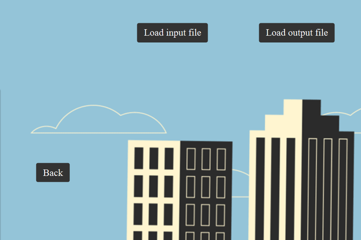
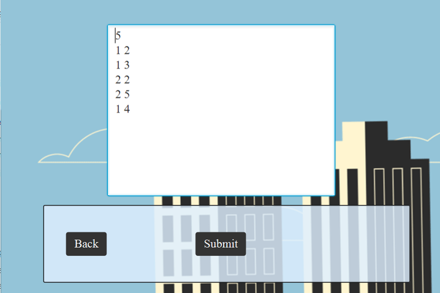
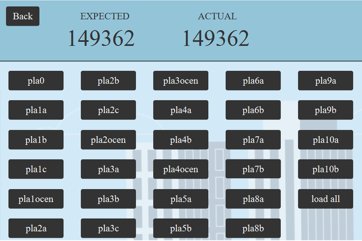

# Plakatowanie
Small application for performing <a href="https://szkopul.edu.pl/problemset/problem/au-E9FH96-3U9rCKhcNsD5n9/site/?key=statement" target="_blank">Plakatowanie</a> algorithm and verifying results.

## Interface - choose one of three ways to load data

You can run the algorithm on data from a file, from input or test existing sets. 

## Test from a file 

When testing from the file, you get to load input file, see the result and load the output file to verify it. 

## Test from input

In order to test from the user input, enter data to the Text Area and Submit to see the result. 

## Test from app

If you don't have any data, you can use data sets prepared by the XV OI. 

Press any button to run an algorithm on provided file and check it with the answers. 

You can also perform the algorithm on all data sets by clicking load all.

